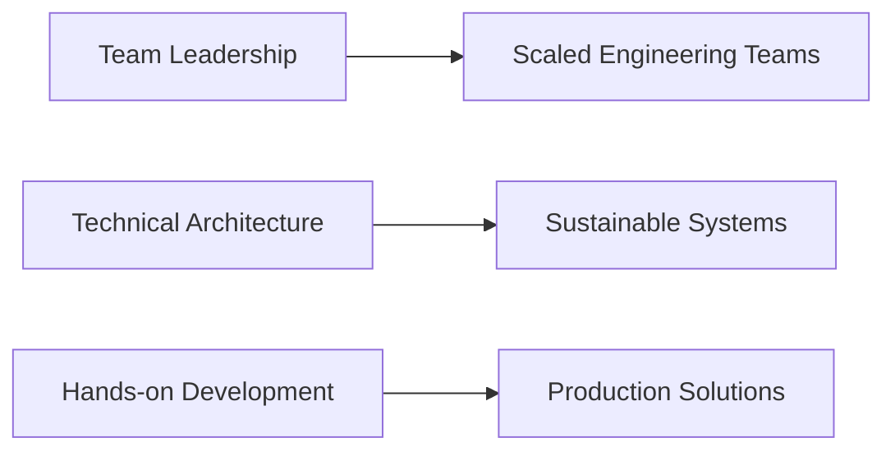

# Steve Alves-Blyt | VP of Engineering & Tech Lead 👋

[](https://www.linkedin.com/in/steve-alves-blyt-19684160)
[](https://dev.to/alvessteve)
[](https://medium.com/@steve.alves2)

## About Me 🚀
Engineering leader and hands-on technologist based in Paris, France. I bridge executive leadership with deep technical expertise, focusing on sustainable solutions and team growth. Whether architecting systems or leading engineering strategy, I believe in staying close to the code while driving organizational success.

```javascript
const steveAlvesBlyt = {
    roles: {
        current: "VP of Engineering & Tech Lead",
        passion: "Sustainable Tech & Team Growth"
    },
    location: "Paris, France",
    expertise: {
        engineering: {
            leadership: ["Strategy", "Team Scaling", "Technical Direction"],
            hands_on: ["System Design", "Architecture", "Code Quality"]
        },
        tech: {
            frontend: ["React", "React Native", "Angular"],
            backend: ["Spring Boot"],
            cloud: ["AWS"],
            practices: ["Microservices", "Modulith", "DevOps", "Green Computing"]
        }
    },
    values: ["Sustainability", "Innovation", "Mentorship"]
};
```

## Professional Journey 🎯

### Leadership & Engineering Mix
- **VP of Engineering** - Leading technical strategy while maintaining hands-on involvement
- **Tech Lead** - Architecting solutions and mentoring teams
- **Senior Engineer** - Building scalable, sustainable systems

### Key Projects & Impacts


## Technical Leadership 💻

### As VP of Engineering
- Built high-performing engineering teams
- Implemented sustainable development practices

### As Tech Lead
- Designed scalable architectures
- Developed React/React Native applications
- Implemented Spring Boot backend solutions

## Content Creation ✍️
I regularly share insights about:
- Engineering Leadership
- Sustainable Tech Practices
- Technical Architecture
- Team Building

Follow my writing:
- [Dev.to Articles](https://dev.to/alvessteve)
- [Medium Stories](https://medium.com/@steve.alves2)

## GitHub Activity 📊


## Green Tech Initiatives 🌱
Leading sustainable technology practices:
- Eco-friendly architecture patterns
- Energy-efficient cloud solutions
- Green computing initiatives
- Environmental impact assessment

## Let's Connect 🤝
- 💼 [LinkedIn](https://www.linkedin.com/in/steve-alves-blyt-19684160)
- 📝 [Medium](https://medium.com/@steve.alves2)
- ✍️ [Dev.to](https://dev.to/alvessteve)
- 📫 salves.blyt@gmail.com

## Tech Stack & Tools 🔧
### Leadership


### Development


---
*"Leading engineering excellence through sustainable practices"*

> Last Updated: 2025-07-07
